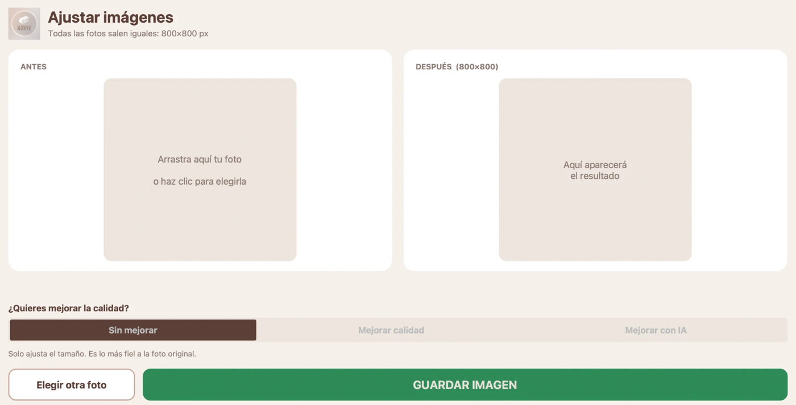

# Ajustar Imágenes

A small desktop app that turns any product photo into a clean, uniform **800×800 px** image, built for a real user: my mother, who runs the online catalogue of a family pharmacy.

**Download (Windows):** [latest release](https://github.com/JaviMilagro/ajustar-imagenes/releases/latest) → `AjustarImagenes.exe` → double-click. No installation, no Python, no internet.



## The problem

Product photos for the shop are pulled from many different websites: different sizes, aspect ratios, amounts of white border and, often, very poor quality. The shop needs every image to look the same. She was resizing them one by one with ChatGPT, which meant opening a chat, uploading, waiting, downloading, and getting slightly different results each time.

Requirements, set by the user and not by me:

- She uploads a photo and gets back the right image. Nothing to configure, nothing to think about.
- The output is **always** 800×800.
- It must run on the pharmacy's Windows PC without installing anything.
- Bad photos should be improvable, but she must be able to tell when the result can't be trusted.

## How it works

```
photo → fix orientation / flatten transparency → crop surrounding white →
        scale to fit with an 8 % margin → (optional enhancement) → centre on a white 800×800 canvas
```

The ratios (8 % margin, trim threshold) were not guessed: I measured them on a set of images that had already been prepared by hand and tuned the code until the output matched within 1–2 px.

### Quality modes

| Mode | What it does | Trade-off |
|---|---|---|
| **Sin mejorar** | Resize only. | Most faithful; small photos look soft. |
| **Mejorar calidad** | Light denoise of JPEG blocking, Lanczos upscale, unsharp mask. | Fast and safe, but the gain is modest. |
| **Mejorar con IA** | 4× super-resolution with Real-ESRGAN (`realesr-general-x4v3`, ONNX, run on CPU through `onnxruntime`, tiled to keep memory low). | Much cleaner edges and gradients, **but it can hallucinate**. |

The AI mode is deliberately an opt-in button rather than the default. On a deliberately degraded test image (170 px wide, JPEG quality 25), it produced visibly cleaner results than the classical mode, but it also distorted small printed text (a brand name came out with a wrong first letter). For a pharmacy, where labels carry ingredients and volumes, that is a real risk, so the interface says so next to the button and the user is expected to check the result before saving. The app also warns, before any enhancement, when the product in the photo is too small and will look blurry.

## Under the hood

- **Python, Pillow, NumPy** for the image pipeline (`ajustar_imagen.py`, no UI dependencies, unit-tested).
- **ONNX Runtime** for inference; the 4.9 MB model ships inside the executable. Inference runs in a worker thread and reports progress to the UI.
- **CustomTkinter + tkinterdnd2** for the interface: before/after cards, drag and drop, progress bar.
- **PyInstaller** packages everything into a single Windows `.exe` (≈ 52 MB) and a macOS `.app`.
- **GitHub Actions** runs the tests and builds both executables on every push (`.github/workflows/build.yml`). I develop on a Mac and have no Windows machine, so CI is the only way I get a Windows build at all.

## Honest limitations

- The Windows build is tested by the actual user on her PC, not by an automated GUI test. The pipeline and the three modes are covered by unit tests (`pytest`).
- The executables are unsigned, so Windows SmartScreen shows a warning the first time, and some antivirus products dislike PyInstaller binaries.
- The enhancement quality is bounded by the input: no model recovers information that the photo never contained. Asking the supplier for a better image still beats any software.
- Output size and margin are constants (`ANCHO`, `ALTO`, `MARGEN`); there is no settings screen on purpose.

## Development

```bash
pip install -r requirements-dev.txt
pytest
python main.py
```

## Credits

Super-resolution model: [Real-ESRGAN](https://github.com/xinntao/Real-ESRGAN) by Xintao Wang et al., BSD-3-Clause (`realesr-general-x4v3`, ONNX export).
